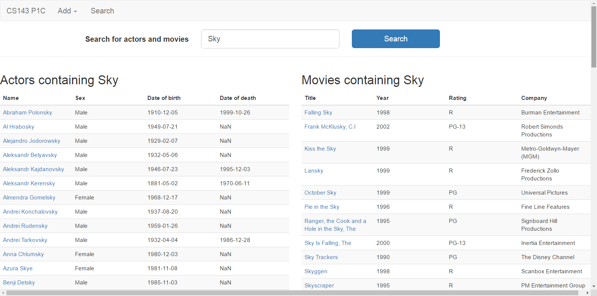
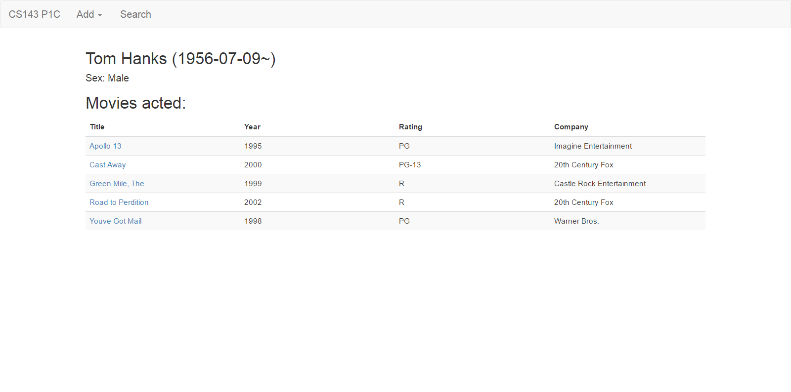
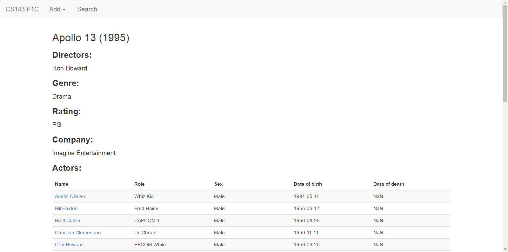
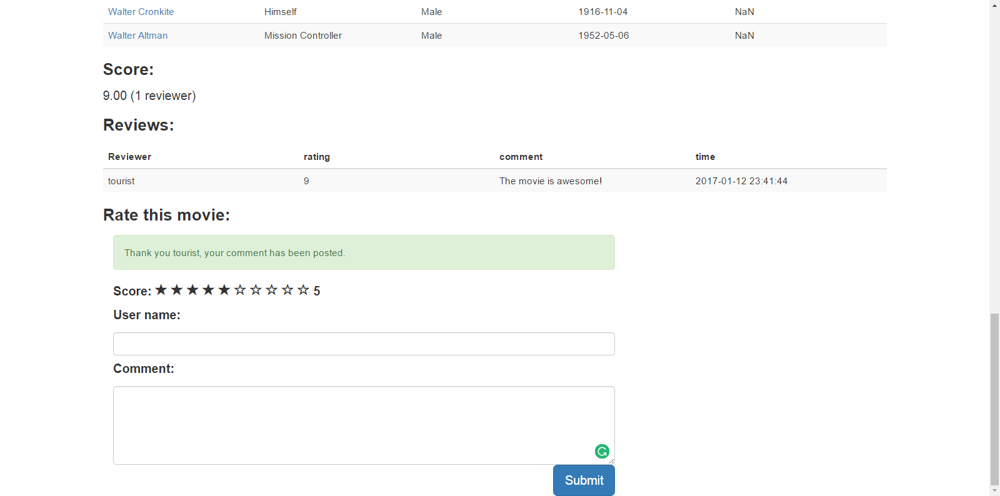
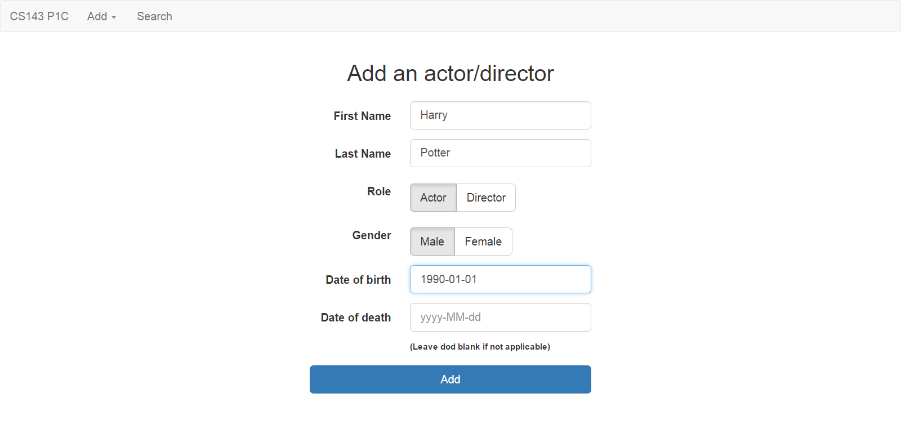
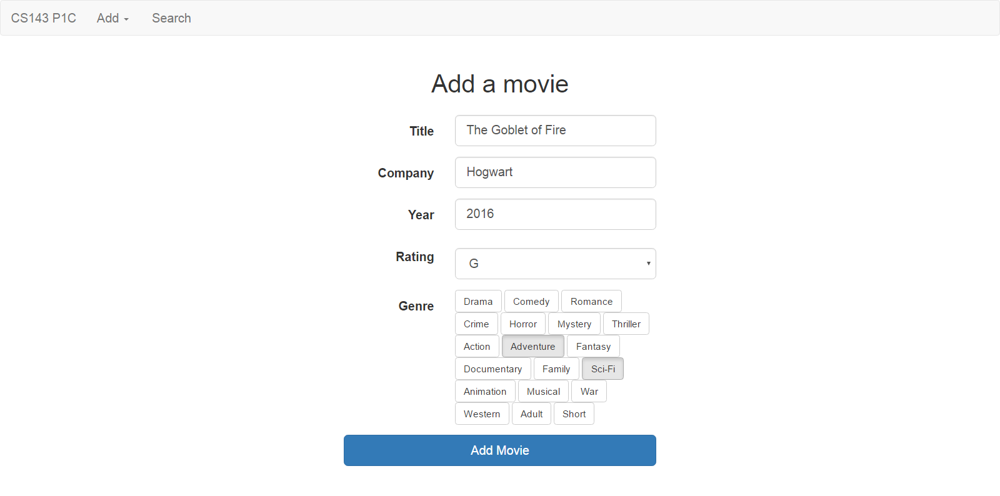
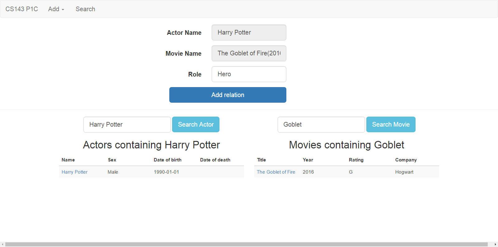

# Movie info website

Website for browsing information related to films, actors and directors

1.  Development of a Single-Page web application following MVC design pattern
2.  Implementation of frontend pages and related user interaction handlers (AngularJS, HTML)
3.  Implementation of backend services that responds to requests for database queries (PHP)
4.  Management of the underlying database (MySQL)

Once the database and PHP files were correctly set up, the website will work as followed.

## Search Page: Search related actors and movies

## Actor Page: Contains links to movies that the actor was in

## Movie Page: Contains links to all the actors acted in the movie 

## Movie Rating: A visitor can rate a movie.

## Add an actor

## Add a movie

## Add an actor to a movie

